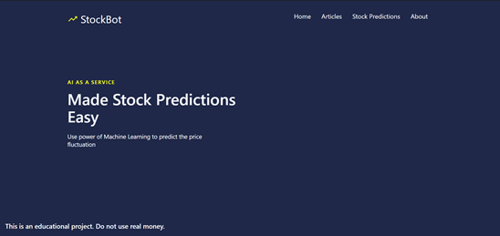

# Stock-Price-Predictions-using-Machine-Learning
## Artificial Intelligence as a Service - <b><i>StockBot</i></b>

### What is a StockBot?
StockBot is a web application build from several micro-services that delivers a sentiment machine learning prediction over the web- application. 

### Installation
Make sure that your development environment meet the following requirements: 
You need to have installed: 

* Python v3.9.*
* Node.js v14.16.*
* npm v7.12.*
* webpack@4.44.2

Make sure that PORT 3000 and PORT 8000 are free to use. 

### How to run the app in the development mode?

Make sure that you're in the right directory when executing the commands. 

#### Run Machine Learning API
1. `Price Predictions using Machine Learning> cd .\backend\` Changes directory to backed folder   
2. `pipenv install` - install dependencies. 
2. `pipenv shell`Starts the python virtual environment
3. `python manage.py runserver` Starts API's development server
4. Leave it running and open new terminal to start front-end interface.

#### Run Front-end Interface 
1. `Stock Price Predictions using Machine Learning> cd .\frontend\` 
2. `npm install` - Installs all needed dependencies
3. `npm start`- Starts the react.js development server

## To see the web application working:

Open [http://localhost:3000](http://localhost:3000) to view it in the browser.

### How to you see it?

1. After successful set up go to the stock prediction page.
2. Input the titles that you want to check against the model.
3. Press the submit button to see the prediction.

### Acknowledgments

I would like to acknowledge my supervisor Dr Renxi Qiu and Dr Vitaly Schetinin for great learning experience and giving me a confidence to tackle ambitious projects. 

#### Troubleshooting

*The API runs at  at http://127.0.0.1:8000/. 

The issues with webpack can be solved by updating the webpack globally at node_modules.

